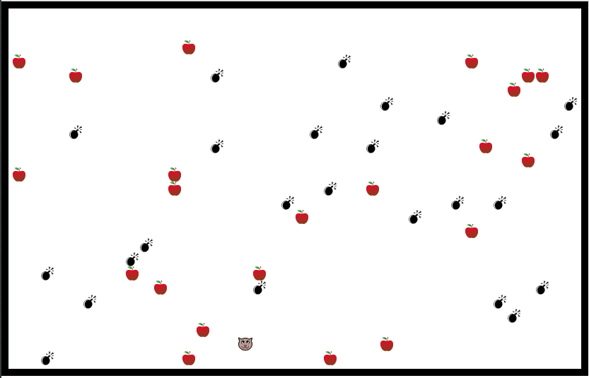

# Palomin

Palomin is a simple game, based on an old **VIC20** game copied from a magazine, that I will use to **teach programming** to my daughters.
The game is written in **Elm**, because this language is simple and concise.

The game challenge is to avoid all bombs and eat all fruits on the screen.

It is a structurally simple game, The only complex sections of the code are:
* the one that generates random values, because Elm is a functional language and generating random values is based on side effects.
* the graphical rendering, which needs some mathematical notions.

The plan is to use [Ellie](https://ellie-app.com) and, starting with a simple **skeleton** of an Elm program, incrementally add parts to it: 
1. add the state (man, bombs, fruits)
2. add a textual version of the view
3. add the keys handling
4. add the random values creation
5. add the rest of the game logic
6. use a graphical version of the view

Here is a picture of the final result. You have to imagine the cat/man moving always upward and the user moving it right or left with the arrow keys.

